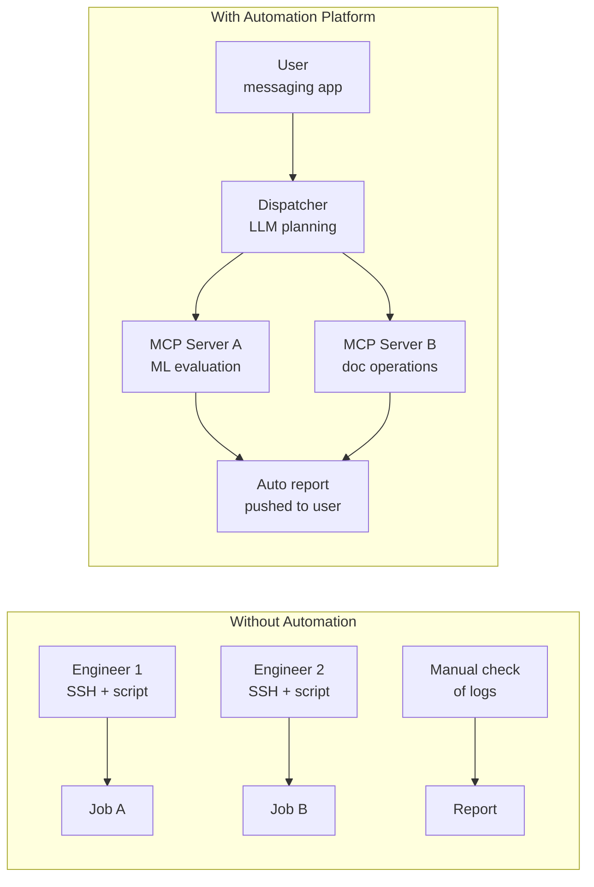
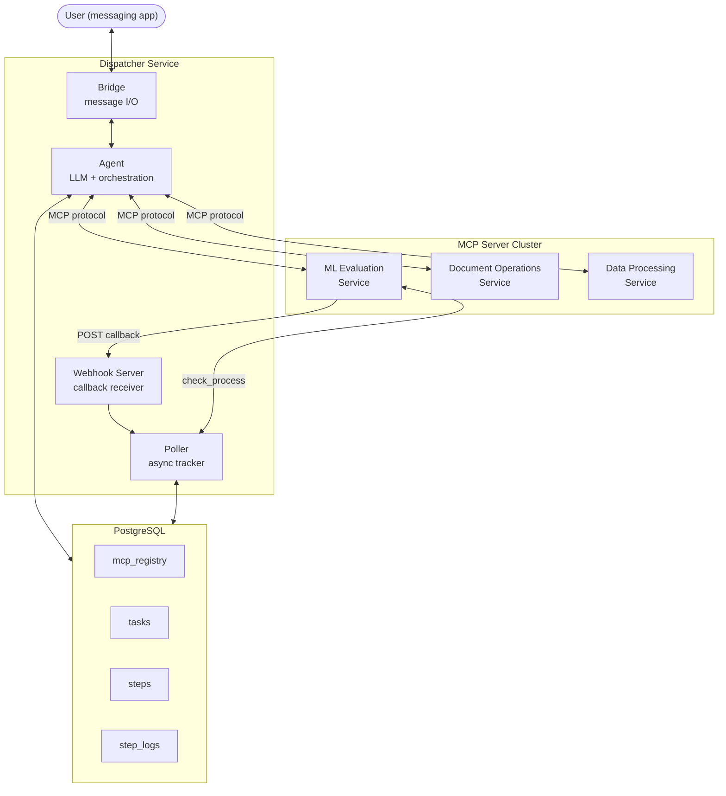
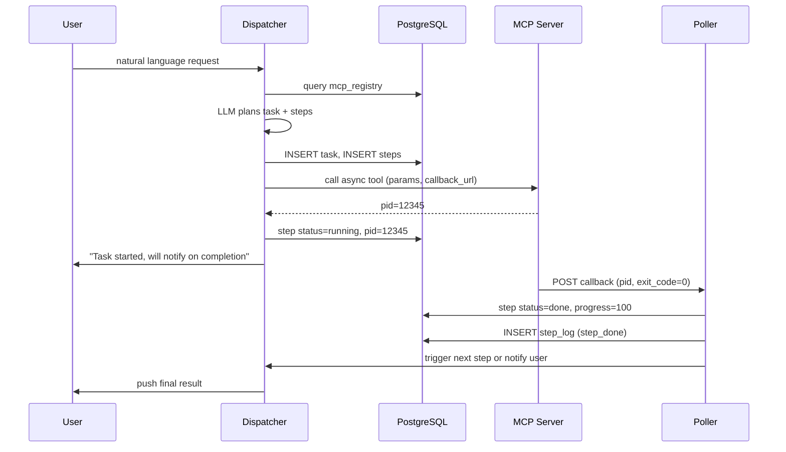
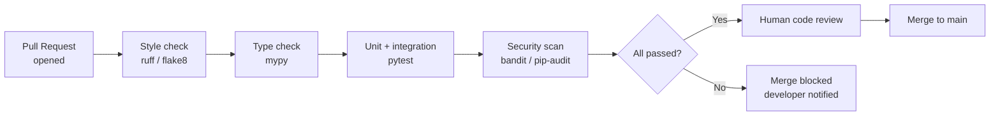
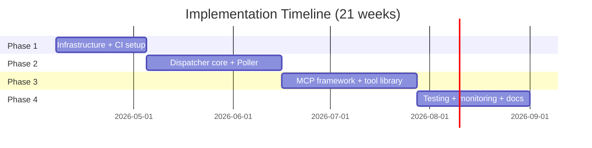

# Internship Project Proposal: MCP-Driven Intelligent Task Automation Platform
> Version: v1 | Date: 2026-04-07 | Programme: NUS-ISS MTech in Software Engineering

## 1. Executive Summary
This proposal outlines the design and implementation of an AI-powered task automation platform built on the **Model Context Protocol (MCP)**. The system allows engineers to issue natural-language instructions through an enterprise messaging platform, which are interpreted by a large language model, decomposed into structured execution steps, dispatched to distributed tool servers, and tracked asynchronously through a PostgreSQL-backed state layer.
The project builds two core components from scratch:
- **Dispatcher Service** — the central orchestrator responsible for user communication, LLM-driven task planning, and step execution
- **MCP Server Framework** — an extensible tool execution layer covering machine learning evaluation, document automation, data processing, and other business domains

The project follows a complete software engineering lifecycle throughout, including requirements management, technical design, coding, security review, automated testing, CI/CD pipelines, and production monitoring.

## 2. Background and Motivation

### 2.1 Industry Context
AI operations teams increasingly coordinate complex, multi-step workflows across heterogeneous infrastructure — GPU clusters for model evaluation, data servers for preprocessing, internal platforms for reporting. As the number of workflow types grows, so does the need for a unified, reliable control plane that can handle long-running jobs, recover from failures, and adapt to changing requirements without requiring engineering intervention.
The emergence of the **Model Context Protocol (MCP)** as an open standard for LLM tool integration provides a timely opportunity to build such a platform on a principled, interoperable foundation.

### 2.2 Current Challenges

#### 2.2.1 Entirely Manual Workflow Coordination
Without any automation system, engineers coordinate multi-step workflows by logging into servers directly, running shared scripts, and handing off results manually. There is no single entry point, no unified view of what is running, and no mechanism for one step's output to automatically feed the next. Every workflow requires human attention at each transition.

#### 2.2.2 No Persistent Task State
Script-based approaches hold execution state in process memory or temporary files. A machine reboot, network drop, or process crash silently discards all in-progress context. Engineers must manually inspect log files to determine what completed and what needs to be restarted — a time-consuming and error-prone recovery process.

#### 2.2.3 Tool Proliferation Without Governance
Each team maintains its own scripts and utilities with no shared discovery mechanism. When a new capability is needed, it must be manually communicated, documented, and integrated into each caller's workflow. There is no standard interface, no versioning, and no way for an LLM to discover or invoke these capabilities programmatically.

#### 2.2.4 Unreliable Long-Running Job Tracking
Machine learning evaluation and data processing jobs run for minutes to hours. Without a dedicated tracking layer, engineers poll log files or check process status manually. There is no proactive notification on completion or failure, and no history of past runs available for audit or debugging.

### 2.3 Project Opportunity

**Figure 2.1 — Manual workflow vs. automated MCP-driven orchestration**

## 3. Project Objectives

### 3.1 Core Goals
- Build a production-grade task automation platform that accepts natural language instructions and reliably executes multi-step workflows
- Design a reusable MCP server framework that allows new tool domains to be added with no changes to the Dispatcher
- Ensure end-to-end resilience: any component (Dispatcher, MCP Server, database) can restart without losing in-flight task state
- Establish a complete software engineering process covering requirements tracking, CI/CD, monitoring, and documentation

### 3.2 Design Principles
- **Single orchestrator**: the Dispatcher is the sole decision-making node; no distributed coordination complexity
- **DB as the only state source**: every task and step state is persisted transactionally; process memory holds nothing critical
- **MCP as the standard tool layer**: all execution capabilities are exposed as MCP tools; the LLM discovers and invokes them dynamically
- **Non-blocking async execution**: long-running tools return a PID immediately; a background Poller tracks completion independently

### 3.3 Success Criteria
| Criterion | Target |
|:---|:---|
| Task recovery after Dispatcher restart | 100% of in-flight tasks resume from DB |
| MCP Server restart transparency | Poller continues tracking via stored PID |
| New tool domain onboarding | Single SQL `INSERT`, zero Dispatcher code changes |
| Async job notification latency | < 5 seconds via MCP callback |
| CI pipeline coverage | Every PR triggers automated test, lint, and security scan |
| Test coverage | All major requirements covered by automated tests |

## 4. Proposed System Architecture

### 4.1 System Overview

**Figure 4.1 — Top-level system component overview**

### 4.2 Dispatcher — Central Orchestrator
The Dispatcher is a single Python process built on `asyncio`. It handles four concerns:
- **Bridge**: maintains a WebSocket connection to the messaging platform, receives user messages, sends cards and text responses
- **Agent**: queries `mcp_registry` to discover active MCP servers, assembles their tool descriptions into the LLM context, invokes the LLM to produce a structured task plan, then drives each step to completion
- **Poller**: a background coroutine that watches all `running` steps, receives MCP callbacks as the primary completion signal, and falls back to periodic `check_process` polling as a reliability guarantee
- **Webhook Server**: a lightweight HTTP listener that receives proactive callback notifications sent by MCP server subprocesses on completion

### 4.3 MCP Server Framework — Tool Execution Layer
The MCP server framework provides a universal engine (`create_server()`) that auto-discovers tools from a directory of `SKILL.md` files. Each `SKILL.md` contains YAML frontmatter declaring the tool's name, parameters, and invocation command, with the markdown body serving as the LLM-visible description.
Adding a new tool requires only:
1. Create a directory with a `SKILL.md` and any supporting scripts
2. Restart the MCP server process
No changes to the Dispatcher, no database updates for tool content.

### 4.4 Database — Single Source of State
Four tables carry the entire runtime state of the system:
- `mcp_registry` — registered MCP servers, queried dynamically on every LLM planning call
- `tasks` — one row per user request, holding the conversation, goal, status, and progress
- `steps` — one row per execution unit, holding tool name, parameters, PID (for async jobs), and status
- `step_logs` — audit event log recording every step status transition (`step_started`, `step_done`, `step_failed`, `step_timeout`, etc.) for debugging and historical traceability

### 4.5 Core Interaction Flow

**Figure 4.2 — End-to-end async task execution flow**

## 5. Software Engineering Process

### 5.1 Requirements Management
The project adopts a numbered requirement document system (`REQ-NNN`). Each requirement moves through the following lifecycle:
- **Analysis**: expand user stories into complete requirement documents with explicit acceptance criteria
- **Technical design**: produce a design document for complex requirements before coding begins; gated by peer review
- **Implementation**: code strictly against the requirement document; no unplanned scope introduced
- **Verification**: after development, verify each acceptance criterion in turn; requirement closed only when all criteria pass

### 5.2 Version Control and Code Review
- All code hosted in a Git repository with branch protection on the main trunk
- Feature development on isolated branches, merged via Pull Request
- PRs require a passing CI run and at least one human code review before merging
- Commit messages follow the Conventional Commits specification

### 5.3 CI Pipeline

**Figure 5.1 — CI pipeline triggered on every pull request**

### 5.4 CD and Deployment
- Merging to main automatically triggers a Docker image build and push to the image registry
- Docker Compose manages the full multi-service deployment (Dispatcher, MCP server cluster, PostgreSQL)
- All environment configuration injected via environment variables; secrets never committed to the repository
- Database schema changes managed through versioned migration scripts that support rollback

### 5.5 Monitoring and Alerting
- Application logs emitted in structured format and collected centrally
- Key metrics instrumented: task success rate, step execution latency, Poller poll interval, LLM call failure rate
- Alerts configured for: step timeout, MCP server connection failure, database connectivity loss

### 5.6 Documentation System
| Document Type | Content | Maintained When |
|:---|:---|:---|
| Requirement docs (REQ-NNN) | Functional requirements, acceptance criteria | Updated on requirement change |
| Technical design docs | Architecture decisions, interface definitions | Completed before coding |
| API / tool reference | MCP tool interface specifications | Synced with implementation |
| Deployment & ops guide | Environment setup, troubleshooting | Completed before each release |
| CHANGELOG | Version change history | Updated on every release |

## 6. Implementation Plan

### 6.1 Phase 1 — Infrastructure (Weeks 1–4)
- Set up PostgreSQL schema (`mcp_registry`, `tasks`, `steps`, `step_logs`)
- Implement messaging platform WebSocket integration and basic message handling
- Build DB access layer with connection pooling
- Configure Git repository, branch protection rules, and baseline CI
- Containerise the full stack with Docker Compose

### 6.2 Phase 2 — Core Dispatcher (Weeks 5–10)
- Implement LLM-driven task planner (intent parsing → task + steps generation)
- Build step executor supporting sync and async modes
- Implement background Poller with callback listener and polling fallback
- Add dynamic tool loading from `mcp_registry`
- Extend CI pipeline with type checking and security scanning

### 6.3 Phase 3 — MCP Framework and Tool Library (Weeks 11–16)
- Build MCP server framework (`create_server()`, SKILL.md parser)
- Implement multiple business domain tool groups (document operations, ML evaluation, data processing pipeline)
- Integrate dynamic step insertion (Tool Signal + LLM Reflection)
- Configure CD pipeline for automated build and deployment on main merge

### 6.4 Phase 4 — Testing, Monitoring, and Documentation (Weeks 17–21)
- End-to-end crash recovery testing (Dispatcher restart, MCP server restart)
- Integrate structured logging and monitoring alerts
- Complete deployment guide, ops runbook, and API reference
- Full requirements verification; close all REQ-NNN items

**Figure 6.1 — Project implementation timeline**

## 7. Technical Approach

### 7.1 Technology Stack
| Layer | Technology | Rationale |
|:---|:---|:---|
| Language | Python 3.13 | Async-native, rich ecosystem |
| Async runtime | `asyncio` + `aiohttp` | Non-blocking I/O for concurrent step execution |
| LLM | Claude (CLI) | Strong structured output, effective task planning |
| Tool protocol | MCP `>=1.0.0`, SSE transport | Open standard, native tool schema, hot-reload |
| Database | PostgreSQL 12+ | JSONB, row-level locking, transactional writes |
| Containerisation | Docker Compose | Reproducible multi-service deployment |
| CI/CD | GitHub Actions / GitLab CI | PR-triggered automation and deployment |
| Code quality | ruff, mypy, bandit | Style, type safety, and security checks |

### 7.2 Key Engineering Challenges

#### 7.2.1 Async Reliability Guarantee
Long-running jobs may complete while the Dispatcher is restarting, or MCP callbacks may be dropped on network failure. The solution is a two-path design: MCP callback as the primary (low-latency) signal, and Poller periodic polling as the fallback. Either path converges the step to a terminal state; neither is a single point of failure.

#### 7.2.2 Dynamic Tool Discovery and Injection
The LLM must see up-to-date tool descriptions on every planning call, without requiring Dispatcher restarts when tools change. This is solved by querying `mcp_registry` fresh on each request, connecting to active MCP servers via the protocol's native tool-listing endpoint, and injecting the result directly into the system prompt.

#### 7.2.3 LLM-Driven Adaptive Planning
Static workflow definitions cannot handle the variability of real-world task outcomes. The LLM Reflection mechanism re-evaluates the remaining plan after each step completes, optionally inserting new steps with decimal sequence numbers (e.g., 2.5) to handle unexpected intermediate results — without disrupting already-running or completed steps.

### 7.3 Risks and Mitigations
| Risk | Likelihood | Mitigation |
|:---|:---|:---|
| LLM service rate limiting | Medium | Automatic fallback to alternate model on rate-limit response |
| MCP server unreachable during planning | Medium | Graceful degradation: skip unavailable servers, log warning |
| Async step timeout (job hangs indefinitely) | Low | Configurable timeout enforced by Poller; force-terminate process on expiry |
| Database connectivity loss | Low | Retry with exponential backoff; Poller pauses until reconnected |

## 8. Expected Outcomes and Learning

### 8.1 Deliverables
- **Dispatcher Service**: production-deployed central orchestrator with messaging integration, LLM planner, step executor, async Poller, Webhook Server, and crash-recovery logic
- **MCP Server Framework**: universal framework and multiple business domain tool groups supporting zero-code tool extension
- **Database Schema**: complete migration scripts covering `mcp_registry`, `tasks`, `steps`, and `step_logs`
- **CI/CD Pipeline**: PR-triggered automated checks (lint, type, test, security) and automated deployment on main merge
- **Test Suite**: automated tests covering all major requirements
- **Documentation**: requirement documents, technical design docs, deployment and ops guide, API reference, CHANGELOG

### 8.2 Engineering Skills Developed
- **Distributed systems**: event-driven architecture, async I/O, crash recovery, state machine design
- **LLM integration**: prompt engineering for structured output, tool schema design, reflection loops
- **Protocol standards**: MCP implementation, SSE transport, tool discovery mechanisms
- **Database engineering**: JSONB schema design, transactional state management, audit logging
- **DevOps**: CI/CD pipelines, Docker multi-service deployment, structured monitoring and alerting

### 8.3 Alignment with MTech SE Programme
| MTech SE Learning Outcome | Project Coverage |
|:---|:---|
| Software architecture and design | MCP-native distributed architecture with clear separation of concerns |
| System reliability and resilience | Two-path async tracking, DB-based crash recovery, timeout enforcement |
| AI/ML system integration | LLM-driven planning, reflection, and dynamic tool invocation |
| Software engineering process | REQ-NNN requirement tracking, code review, CI/CD, documentation system |
| Scalable system design | Multi-node MCP registry, load-balanced tool routing, hot-reload without restart |
