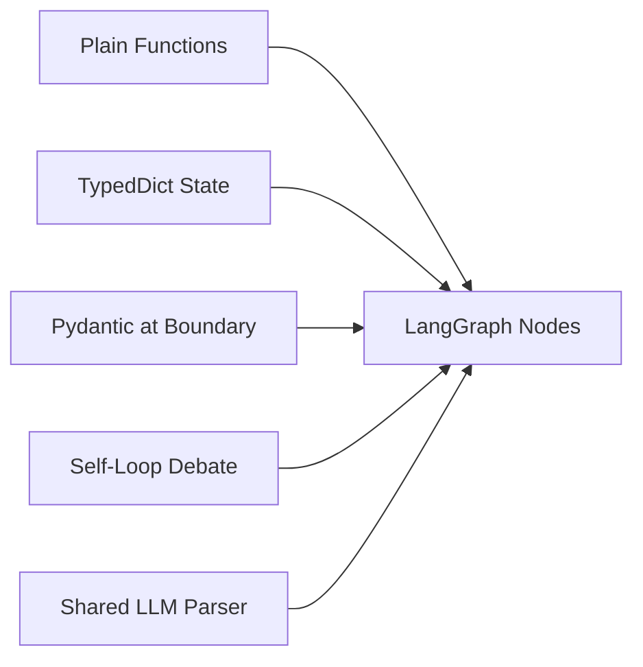
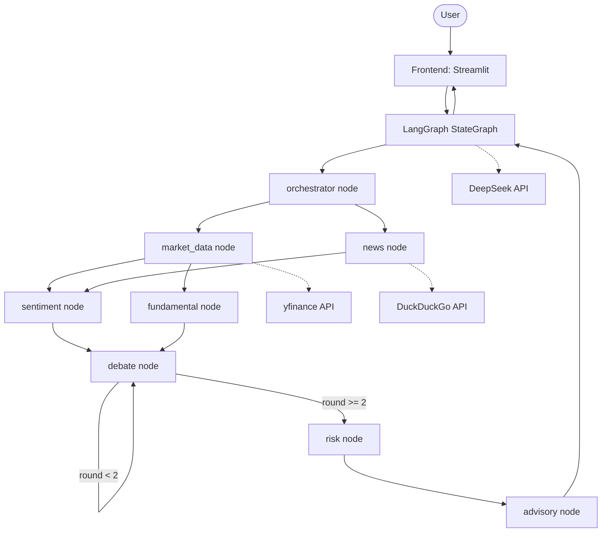
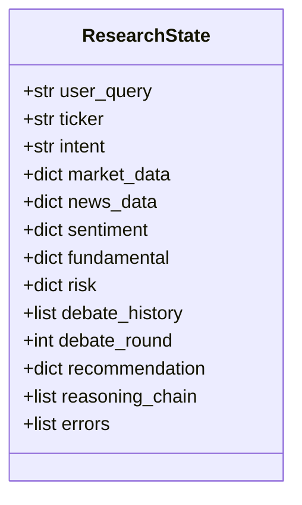
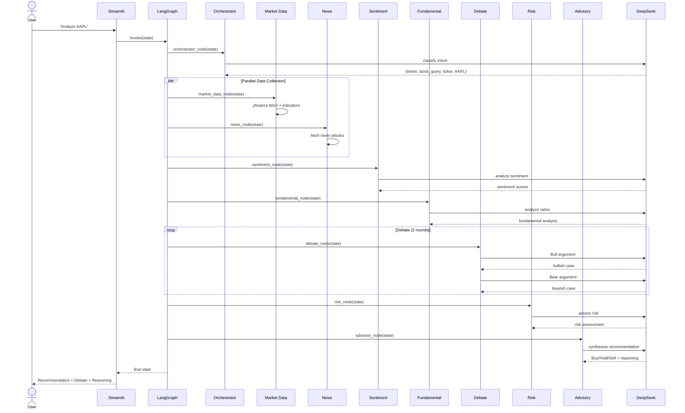

# REQ-001 Technical Design
> Status: Technical Finalized
> Requirement: requirement.md
> Created: 2026-04-06
> Updated: 2026-04-06

## 1. Technology Stack

| Module | Technology | Rationale |
|:---|:---|:---|
| Language | Python 3.11+ | Team expertise, rich AI ecosystem |
| Agent Orchestration | LangGraph 0.3+ | Native StateGraph, conditional edges, fan-out/fan-in, cycle support for debate |
| LLM | DeepSeek (deepseek-chat) via OpenAI-compatible API | Cost-effective, good structured output, function calling support |
| Financial Data | yfinance | Free, reliable, no API key required for basic data |
| News Data | yfinance news + DuckDuckGo search | Free, no API key required |
| UI | Streamlit | Rapid prototyping, built-in chat component, session state |
| Data Validation | Pydantic v2 | Type safety at agent boundaries, JSON schema generation |
| Testing | pytest + pytest-asyncio | Standard Python testing |
| Deployment | Docker Compose | Single-command startup |
| Logging | structlog | Structured JSON logging |

## 2. Design Principles


**Figure 2.1 — Core design principles**

- **Plain functions as agents**: each agent is a function `(state: dict) -> dict`, no base class, no ABC
- **TypedDict for graph state**: survives LangGraph serialization without issues
- **Pydantic at boundaries**: validate data entering/leaving agents, store as plain dicts in graph
- **Self-loop debate**: conditional edge cycle, not subgraph — simpler debugging
- **Centralized LLM parsing**: `call_llm_structured()` with retry-with-reprompt handles DeepSeek JSON quirks
- **Schema freeze day 1**: `state.py` is the integration contract between all team members

## 3. Architecture Overview


**Figure 3.1 — System architecture with LangGraph orchestration**

Source code layout:

```
backend/                  # Backend services
├── config.py             # Pydantic Settings
├── state.py              # ResearchState TypedDict + Pydantic validators
├── llm_client.py         # DeepSeek wrapper + structured output + retry
├── graph.py              # LangGraph graph builder
├── agents/               # Agent node functions
│   ├── orchestrator.py
│   ├── market_data.py
│   ├── news.py
│   ├── sentiment.py
│   ├── fundamental.py
│   ├── risk.py
│   ├── debate.py
│   └── advisory.py
├── data/                 # External data fetchers
│   ├── market_api.py
│   ├── news_api.py
│   └── mock_data.py
└── prompts/              # Prompt templates
frontend/                 # Frontend application
├── app.py                # Streamlit entry point
tests/                    # Test suite
```

## 4. Module Design

### 4.1 State Module (backend/state.py)
- **Responsibility**: Define the shared state contract between all agents
- **Public interface**: `ResearchState` TypedDict, Pydantic validator models
- **Internal structure**: TypedDict for LangGraph compatibility, Pydantic models for boundary validation
- **Reuse notes**: Every agent imports state types from this module

### 4.2 LLM Client Module (backend/llm_client.py)
- **Responsibility**: DeepSeek API communication, structured output parsing, retry logic
- **Public interface**: `call_llm()`, `call_llm_structured()`
- **Internal structure**: OpenAI-compatible client, JSON extraction, markdown fence stripping, retry-with-reprompt
- **Reuse notes**: Every LLM-powered agent uses `call_llm_structured()`

### 4.3 Agent Modules (backend/agents/)
- **Responsibility**: Each file contains one agent node function
- **Public interface**: `def agent_name(state: dict) -> dict`
- **Internal structure**: Read state fields → call APIs/LLM → validate output with Pydantic → return partial state update as plain dict
- **Reuse notes**: All agents share llm_client and state types

### 4.4 Data Module (backend/data/)
- **Responsibility**: External API wrappers with fallback to mock data
- **Public interface**: `fetch_market_data()`, `fetch_news()`, mock functions
- **Internal structure**: Try live API → catch exception → return mock data with flag

### 4.5 Graph Module (backend/graph.py)
- **Responsibility**: Wire all agents into LangGraph StateGraph
- **Public interface**: `build_graph() -> CompiledGraph`
- **Internal structure**: Node registration, edge definitions, conditional debate loop, fan-out/fan-in

### 4.6 Frontend Module (frontend/app.py)
- **Responsibility**: Streamlit chat UI, session management, result rendering
- **Public interface**: Streamlit app entry point
- **Internal structure**: Chat input → invoke graph → render recommendation + debate + reasoning

## 5. Data Model


**Figure 5.1 — ResearchState structure**

## 6. API Design

No external API exposed. The system is a single-process Streamlit app that invokes LangGraph internally. External APIs consumed:
- DeepSeek Chat API (OpenAI-compatible)
- yfinance (Python library, no REST API)
- DuckDuckGo search (via duckduckgo-search library)

## 7. Key Flows


**Figure 7.1 — Full stock analysis sequence**

## 8. Shared Modules & Reuse Strategy

| Shared Component | Used By | Location |
|:---|:---|:---|
| `ResearchState` | All agents | `backend/state.py` |
| `call_llm_structured()` | sentiment, fundamental, risk, debate, advisory, orchestrator | `backend/llm_client.py` |
| Mock data | market_data, news (fallback) | `backend/data/mock_data.py` |
| Config/Settings | All modules | `backend/config.py` |

## 9. Risks & Notes

| Risk | Impact | Mitigation |
|:---|:---|:---|
| DeepSeek returns malformed JSON | All LLM-powered agents fail | `call_llm_structured()` strips markdown fences, retries with reprompt (max 2) |
| LangGraph serialization breaks Pydantic | State corruption between nodes | Use TypedDict state, Pydantic only at boundaries |
| yfinance rate limiting | Market data unavailable | Mock data fallback within 3s |
| Debate loop livelock | System hangs | Integer-based round counter with hard max=2 |
| DeepSeek API latency | >30s response time | Parallel fan-out for data collection, timeout per agent |

## 10. Change Log

| Version | Date | Changes | Affected Scope | Reason |
|:---|:---|:---|:---|:---|
| v1 | 2026-04-06 | Initial version | ALL | - |
