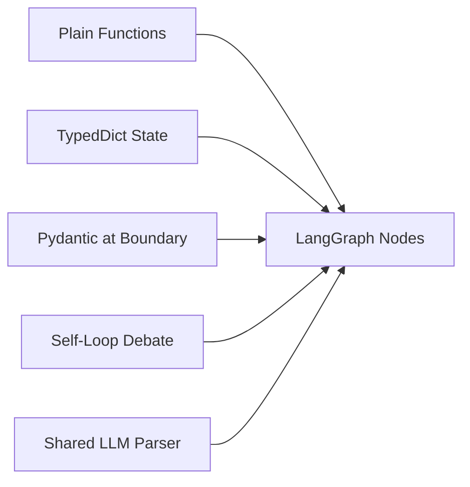
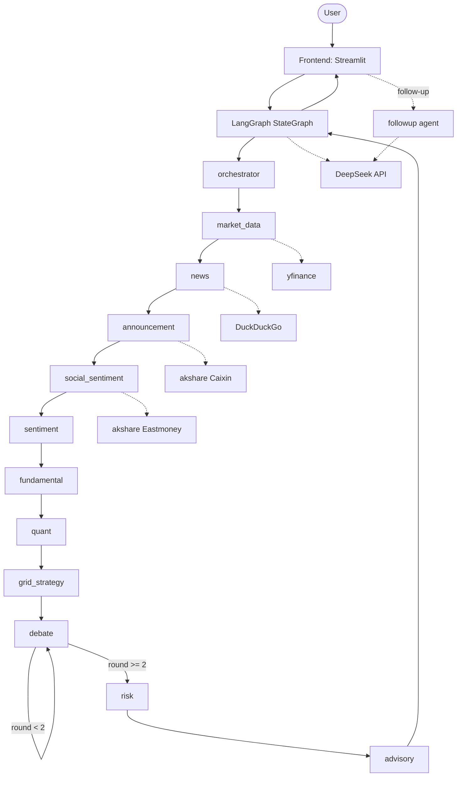
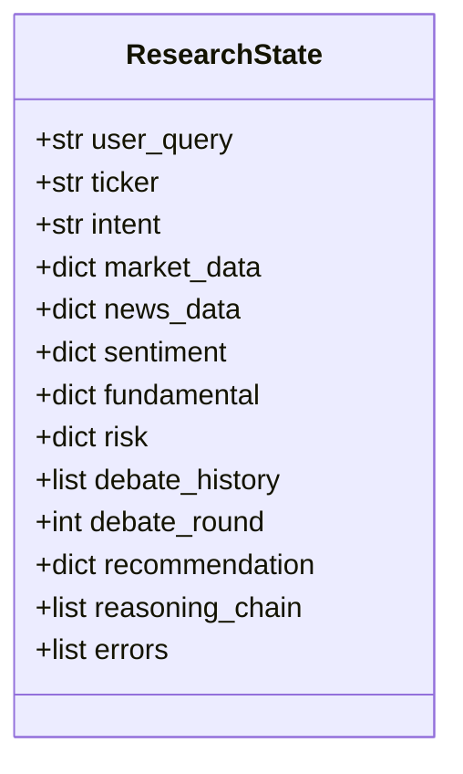
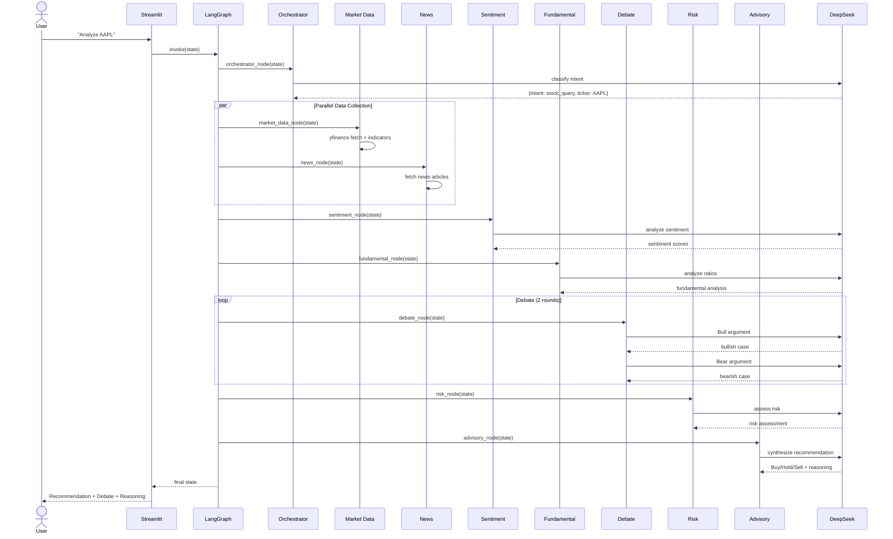
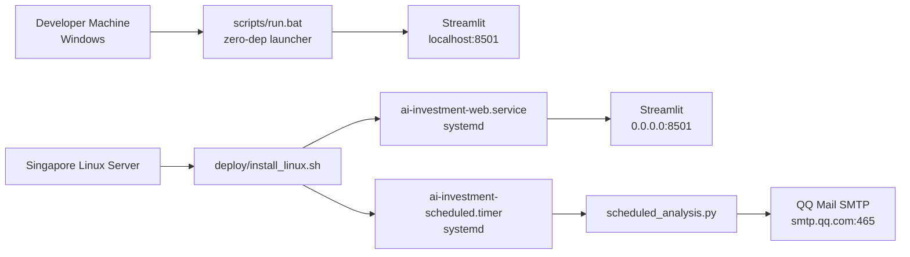

# REQ-001 Technical Design
> Status: Technical Finalized
> Requirement: requirement.md
> Created: 2026-04-06
> Updated: 2026-04-07 (v2)

## 1. Technology Stack

| Module | Technology | Rationale |
|:---|:---|:---|
| Language | Python 3.11+ | Modern type hints, rich AI ecosystem |
| Agent Orchestration | LangGraph 0.3+ | Native StateGraph, conditional edges, self-loop for debate |
| LLM | DeepSeek (deepseek-chat) via OpenAI-compatible API | Cost-effective, China-accessible, good structured output |
| Global Market Data | yfinance | Free, no API key, US/HK/A-share support |
| Chinese Data | akshare (Eastmoney / Sina / THS / Caixin backends) | Free, no API key, China-accessible, 1000+ interfaces |
| News Data | yfinance news + DuckDuckGo search | Free, no API key |
| UI | Streamlit | Rapid chat UI, built-in session state |
| Data Validation | Pydantic v2 | Type safety at agent boundaries, JSON schema generation |
| Email | smtplib (Python stdlib) | QQ Mail SMTP_SSL on port 465 |
| Browser Automation | Playwright | Frontend testing |
| Testing | pytest | Real API tests, no mocks |
| Deployment | systemd (Linux) + Windows Task Scheduler | Native scheduling, no Docker required |
| Package Manager | uv | Fast, reproducible Python environments |
| Logging | structlog | Structured JSON logging with correlation IDs |

## 2. Design Principles


**Figure 2.1 — Core design principles**

- **Plain functions as agents**: each agent is a function `(state: dict) -> dict`, no base class, no ABC
- **TypedDict for graph state**: survives LangGraph serialization without issues
- **Pydantic at boundaries**: validate data entering/leaving agents, store as plain dicts in graph
- **Self-loop debate**: conditional edge cycle, not subgraph — simpler debugging
- **Centralized LLM parsing**: `call_llm_structured()` with retry-with-reprompt handles DeepSeek JSON quirks
- **Schema freeze day 1**: `state.py` is the integration contract between all team members

## 3. Architecture Overview


**Figure 3.1 — 11-agent LangGraph architecture**

Each agent lives in its own Python sub-package under `backend/agents/<name>/`. Source code layout:

```
backend/
├── config.py                     # Settings + .env auto-loader
├── state.py                      # ResearchState TypedDict + Pydantic models
├── llm_client.py                 # DeepSeek wrapper + structured output + retry
├── graph.py                      # LangGraph StateGraph builder (11 agents)
├── agents/
│   ├── orchestrator/
│   │   ├── __init__.py           # exports orchestrator_node
│   │   └── node.py
│   ├── market_data/
│   │   ├── node.py
│   │   ├── providers.py          # yfinance live data
│   │   └── mock.py               # demo fallback
│   ├── news/
│   │   ├── node.py
│   │   └── sources.py            # yfinance + DuckDuckGo + dedup
│   ├── announcement/
│   │   ├── node.py
│   │   └── sources.py            # akshare Caixin / financial abstract
│   ├── social_sentiment/
│   │   ├── node.py
│   │   └── sources.py            # akshare Eastmoney 股吧
│   ├── sentiment/
│   │   └── node.py
│   ├── fundamental/
│   │   └── node.py
│   ├── quant/
│   │   ├── node.py               # composite scoring
│   │   └── signals.py            # MA / RSI / MACD / range / P/E sub-modules
│   ├── grid_strategy/
│   │   ├── node.py
│   │   └── calculator.py         # grid math, fee model, A-share lot size
│   ├── debate/
│   │   └── node.py               # Bull vs Bear self-loop
│   ├── risk/
│   │   └── node.py
│   ├── advisory/
│   │   └── node.py
│   └── followup/
│       └── node.py               # post-analysis Q&A with full context
├── notification/
│   ├── email_sender.py           # QQ SMTP_SSL on port 465
│   └── templates.py              # HTML email templates
frontend/
└── app.py                        # Streamlit chat UI
scripts/
├── run.bat / run.sh              # zero-dep launchers
├── scheduled_analysis.py         # standalone scheduled task
├── scheduled_analysis.bat/.sh    # logging wrappers
└── register_schedule.bat         # Windows Task Scheduler registration
deploy/
├── install_linux.sh              # systemd + ufw setup
└── README.md                     # Linux deployment guide
tests/
├── agents/                       # one sub-package per agent
└── e2e/                          # full pipeline tests
```

## 4. Module Design

### 4.1 State Module (backend/state.py)
- **Responsibility**: Define the shared state contract between all agents
- **Public interface**: `ResearchState` TypedDict, Pydantic validator models
- **Internal structure**: TypedDict for LangGraph compatibility, Pydantic models for boundary validation
- **Reuse notes**: Every agent imports state types from this module

### 4.2 LLM Client Module (backend/llm_client.py)
- **Responsibility**: DeepSeek API communication, structured output parsing, retry logic
- **Public interface**: `call_llm()`, `call_llm_structured()`
- **Internal structure**: OpenAI-compatible client, JSON extraction, markdown fence stripping, retry-with-reprompt
- **Reuse notes**: Every LLM-powered agent uses `call_llm_structured()`

### 4.3 Agent Modules (backend/agents/)
- **Responsibility**: Each file contains one agent node function
- **Public interface**: `def agent_name(state: dict) -> dict`
- **Internal structure**: Read state fields → call APIs/LLM → validate output with Pydantic → return partial state update as plain dict
- **Reuse notes**: All agents share llm_client and state types

### 4.4 Data Module (backend/data/)
- **Responsibility**: External API wrappers with fallback to mock data
- **Public interface**: `fetch_market_data()`, `fetch_news()`, mock functions
- **Internal structure**: Try live API → catch exception → return mock data with flag

### 4.5 Graph Module (backend/graph.py)
- **Responsibility**: Wire all agents into LangGraph StateGraph
- **Public interface**: `build_graph() -> CompiledGraph`
- **Internal structure**: Node registration, edge definitions, conditional debate loop, fan-out/fan-in

### 4.6 Frontend Module (frontend/app.py)
- **Responsibility**: Streamlit chat UI, session management, result rendering
- **Public interface**: Streamlit app entry point
- **Internal structure**: Chat input → invoke graph → render recommendation + debate + reasoning

## 5. Data Model


**Figure 5.1 — ResearchState structure**

## 6. API Design

No external API exposed. The system is a single-process Streamlit app that invokes LangGraph internally. External APIs consumed:
- DeepSeek Chat API (OpenAI-compatible)
- yfinance (Python library, no REST API)
- DuckDuckGo search (via duckduckgo-search library)

## 7. Key Flows


**Figure 7.1 — Full stock analysis sequence**

## 8. Shared Modules & Reuse Strategy

| Shared Component | Used By | Location |
|:---|:---|:---|
| `ResearchState` TypedDict | All 11 agents | `backend/state.py` |
| `call_llm_structured()` | orchestrator, sentiment, fundamental, risk, debate, advisory, followup | `backend/llm_client.py` |
| `call_llm()` (raw) | followup | `backend/llm_client.py` |
| Mock market data | market_data (fallback) | `backend/agents/market_data/mock.py` |
| Pydantic output models | All LLM agents | `backend/state.py` |
| Config / Settings | All modules | `backend/config.py` |
| Email sender | scheduled task | `backend/notification/email_sender.py` |
| Email templates | scheduled task | `backend/notification/templates.py` |

## 9. Deployment Architecture


**Figure 9.1 — Cross-platform deployment**

| Environment | Launcher | Scheduling |
|:---|:---|:---|
| Windows dev | `scripts/run.bat` (auto-installs uv, venv, deps) | `scripts/register_schedule.bat` (Task Scheduler) |
| Linux prod | `deploy/install_linux.sh` (sudo, systemd setup) | systemd timer `Mon..Fri 09:30 UTC` (= 17:30 SGT) |

## 10. Risks & Notes

| Risk | Impact | Mitigation |
|:---|:---|:---|
| DeepSeek returns malformed JSON | All LLM-powered agents fail | `call_llm_structured()` strips markdown fences, retries with reprompt (max 2) |
| LangGraph serialization breaks Pydantic | State corruption between nodes | Use TypedDict state, Pydantic only at boundaries |
| yfinance rate limiting | Market data unavailable | Mock data fallback within 3s |
| akshare rate limiting | Announcement / social data missing | Catch exception, return empty dict, do not crash pipeline |
| DuckDuckGo 403 rate limit | News collection partially fails | yfinance news fallback, mock news as last resort |
| Debate loop livelock | System hangs | Integer-based round counter with hard max=2 |
| QQ SMTP authentication failure | Scheduled email not sent | Pre-flight config validation, clear error about authorization code |
| Multiple Python installs on Windows | Streamlit uses wrong Python, missing deps | uv venv ensures consistent environment |
| Grid strategy fees > profit | Misleading user expectation | Caveat surfaced per strategy when fees exceed grid step profit |
| Follow-up confused with new analysis | User asks about new ticker, system uses stale context | Heuristic detects new ticker pattern, re-routes to full pipeline |

## 11. Change Log

| Version | Date | Changes | Affected Scope | Reason |
|:---|:---|:---|:---|:---|
| v1 | 2026-04-06 | Initial version: 7 agents, LangGraph + DeepSeek, single Streamlit UI, Docker deploy | ALL | - |
| v2 | 2026-04-07 | Restructure agents into sub-packages; add Quant, Grid Strategy, Announcement, Social Sentiment, Followup, Notification modules; add Linux systemd deployment; replace Docker with native venv launchers; rewrite architecture diagram and source code layout; add deployment architecture section; expand risks table | Section 1, Section 3, Section 8, Section 9 (new), Section 10 | New requirements F-20..F-26: algorithmic referees, akshare data, conversational follow-up, QQ email, Linux deployment |
